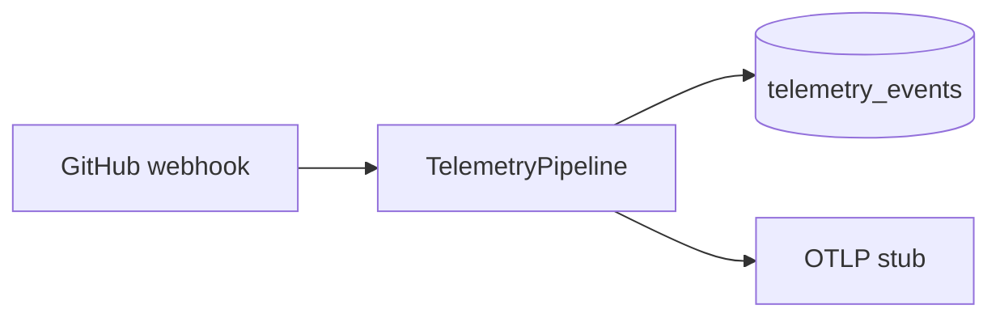
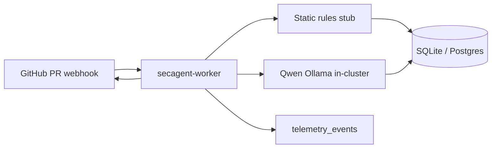

# li-sec-agent

AI **security agent** for pull requests — CodeRabbit-style flow with **actionable mitigations** (suggested patches, CWE/OWASP references), security-first findings, **on-cluster Qwen** (Ollama OpenAI API), and **telemetry-first data capture** (events, metering, training labels) as core product infrastructure.

Homelab staging target: **blackpearl** k3s (`secagent-staging` namespace). Ecosystem: [**li-langverse**](https://github.com/li-langverse); first consumer can be [**majico**](https://github.com/cap-jmk-launchpad/majico) via GitHub App.

## Monetization (short)

- **SaaS per-seat / per-org** — tiered by private repos and monthly PR volume.
- **GitHub Marketplace** — install the App; free tier for public OSS, paid for private + SLA.
- **Usage-based** — bill on PR lines scanned and model tokens (pass-through + margin).
- **Mitigation quality (premium)** — inline `suggested_patch` comments, custom org templates, and higher-accuracy models on Team/Business tiers ([MITIGATION_REVIEWS.md](docs/MITIGATION_REVIEWS.md)).
- **Enterprise on-prem** — Helm chart + air-gapped Qwen; annual license, no code egress.
- **Findings-as-a-service** — anonymized CVE/category feed for SIEM / SOC platforms (opt-in).

## What we store

| Data | Notes |
|------|--------|
| Findings | Severity, category, file/line, evidence, confidence, CWE, source (`qwen` / `static`) |
| Mitigations | Title, description, optional patch, effort, references (hashed in telemetry) |
| `diff_hash` | SHA-256 of normalized patch (not always full diff) |
| Model traces | `prompt_hash`, `response_hash`, token counts, latency |
| Webhook metadata | `delivery_id`, repo, PR number, SHAs |
| Feedback | `true_positive` / `false_positive` labels for training |

**Retention (staging defaults):** findings 90d, traces 180d — override per tenant in prod.  
**Privacy:** core inference stays on your cluster; SaaS control plane never needs raw repo access if App runs in customer VPC.

Details: [docs/VISION.md](docs/VISION.md) · Telemetry: [docs/DATA_CAPTURE.md](docs/DATA_CAPTURE.md).

## Telemetry (day one)

Every pipeline step emits typed events to `telemetry_events` + structured logs; optional OTLP via `OTEL_EXPORTER_OTLP_ENDPOINT`. Usage rows in `usage_metering` power billing (`org_id`, `lines_scanned`, `tokens_in/out`, `tier`). Feedback: `POST /feedback/{findingId}`.



## Architecture



## Quick start (local)

```bash
cp .env.example .env
npm install && npm run build
# Point QWEN_BASE_URL at cluster NodePort or local Ollama
npm start
```

Health: `GET /healthz` · Webhook stub: `POST /webhooks/github`

## Cluster deploy

```powershell
.\scripts\deploy-staging.ps1
```

| Endpoint | URL |
|----------|-----|
| Qwen (in-cluster) | `http://qwen-ollama.secagent-staging.svc.cluster.local:11434` |
| OpenAI-compatible | `http://qwen-ollama.secagent-staging.svc.cluster.local:11434/v1` |
| Qwen (LAN NodePort) | `http://192.168.10.33:31434` |

**Default model (RTX 3060 12 GB):** `qwen3.5:9b` — best benchmark F1/recall; ~8.4 GB VRAM. Alternative: `qwen2.5-coder:14b` (faster, code-tuned, ~11 GB VRAM). Avoid `qwen2.5-coder:3b` for security reviews (near-zero recall). See [docs/MODEL_EVAL.md](docs/MODEL_EVAL.md).

**Qwen pod node:** `engine` (192.168.10.32) — single `nvidia.com/gpu: 1`. blackpearl has no GPU. To move Qwen, edit `nodeSelector.kubernetes.io/hostname` in `infra/k8s/staging/qwen-ollama.deployment.yaml` (`engine` | `desktop`).

### Model comparison (staging benchmark)

| Model | F1 | Recall | FP rate | p50 latency | VRAM |
|-------|-----|--------|---------|-------------|------|
| `qwen2.5-coder:3b` | 0.00 | 0.00 | 0.00 | ~64 ms | ~3 GB |
| `qwen2.5-coder:14b` | 0.62 | 0.67 | 0.33 | ~3 s | ~11 GB |
| `qwen3.5:9b` | 0.69 | 0.83 | 0.50 | ~8.9 s | ~8.4 GB |
| `qwen3.5:27b` | N/A | — | — | — | OOM on 12 GB |

Run benchmark: `npm run eval:models` (outputs to `eval/results/`).

See [infra/k8s/staging/README.md](infra/k8s/staging/README.md).

## PR integration

[docs/PR_INTEGRATION.md](docs/PR_INTEGRATION.md) — GitHub App permissions, webhook events, comment format, majico wiring.

## Repo layout

```
src/           webhook handler, scanner orchestrator, Qwen client, data store
src/telemetry/ pipeline, privacy redaction, OTLP stub
schemas/       finding + telemetry JSON Schema
migrations/    SQL schema (findings + telemetry_events)
docs/          DATA_CAPTURE.md, VISION.md, PR_INTEGRATION.md, MITIGATION_REVIEWS.md, MODEL_EVAL.md
eval/          benchmark-cases.json, results/ (gitignored)
scripts/       deploy-staging.ps1 / .sh, eval-models.ts, pull-eval-models.sh
```

## License

MIT — see [LICENSE](LICENSE).
