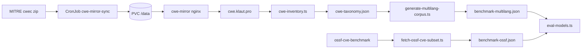

# CWE benchmark expansion — master plan

**Status:** Phase 0 complete; **v1 taxonomy + synthetic scenarios complete** (2026-06-04)  
**Owner:** li-sec-agent / li-langverse  
**Related:** [MULTILANG_BENCHMARK.md](./MULTILANG_BENCHMARK.md), [OFFICIAL_EVAL_BENCHMARKS.md](./OFFICIAL_EVAL_BENCHMARKS.md), [MODEL_EVAL.md](./MODEL_EVAL.md)

---

## Executive summary

li-sec-agent already ships a **840-case** synthetic multilanguage PR-diff corpus (`eval/benchmark-multilang.json`) covering **22 CWE families** across C, C++, Rust, Python, JavaScript, and TypeScript. The homelab **CWE mirror** at `https://cwe.klaut.pro` exposes the full MITRE catalog (**969 weaknesses**, CWE **4.20**) but **does not store CVEs, exploits, or PoCs** — it is a taxonomy cache only.

This plan expands benchmarks by:

1. Using the mirror + MITRE REST for **CWE inventory and naming**
2. Sourcing **real CVE commit diffs** from OpenSSF CVE Benchmark (primary) and PrimeVul/JitVul/CVEfixes (secondary) per [OFFICIAL_EVAL_BENCHMARKS.md](./OFFICIAL_EVAL_BENCHMARKS.md)
3. Generating **3–5 safe, synthetic, testable scenarios per CWE family** per applicable language
4. Integrating everything into the existing `scripts/eval-models.ts` harness

**Phase 0 finding:** Treat “CWE DB” as **taxonomy + external CVE datasets**, not a single exploit database on Kubernetes.

---

## Goals and success metrics

| Goal | Metric | Baseline | Target (v1) | Stretch (v2) |
|------|--------|----------|-------------|--------------|
| CWE coverage | Unique CWE ids with ≥1 harness case | 22 | **50** (backlog) | 100+ (Stable Base from mirror) |
| Scenario depth | Positive scenarios per CWE×language | ~1 template | **3–5** variants | 5 + negatives |
| Languages | c, cpp, rust, python, js, ts | 6 | 6 | +optional Go/Java subset |
| Corpus size | Total `BenchmarkCase` rows | 840 | **2,500+** | 5,000+ |
| Real-world slice | OpenSSF-derived diff cases | 0 | **50–100** CVEs | 218+ |
| Eval quality | Category precision/recall on smoke | documented in MODEL_EVAL | ≥ baseline on 10-case smoke | no regression on negatives |
| Testability | % cases with deterministic oracle | ~100% synthetic | 100% synthetic + labeled OSSF | CI `CASE_LIMIT` smoke green |

**Non-goals:** Weaponized exploits, live attack payloads, or full 969-CWE mechanical translation (many are organizational/pillar-level, not code-review patterns).

---

## Phase 0 — Discovery (complete)

### CWE mirror inventory

| Field | Value |
|-------|-------|
| Public URL | `https://cwe.klaut.pro` |
| Health | `GET /health` → `ok` |
| Catalog | CWE **4.20** (2026-04-30) |
| `weakness_count` (manifest) | **969** |
| Synced at | 2026-06-03T07:54:12Z |
| SHA-256 (zip) | `3976f599e5e5200219a3108bb896d06e2a88fbb293369e1883cb423a5e9d7d50` |
| Cluster | `blackpearl` — namespace `cwe`, NodePort **30483**, deployment `cwe-mirror` **Running** |
| In-cluster | `http://cwe-mirror.cwe.svc.cluster.local:8080/` |

### HTTP API (static files — not REST CRUD)

| Path | Content | Notes |
|------|---------|-------|
| `/health` | `ok` | WAN verified |
| `/manifest.json` | version, sha, `weakness_count`, MITRE REST base | |
| `/weaknesses.json` | `{id, name, abstraction, status, structure}[]` | **969** entries; `name` often **empty** in index |
| `/cwec_latest.xml` | Full MITRE XML | **403** on public edge (size/policy); use LAN NodePort or in-cluster |

**Not present on mirror:** `/api/v1/*`, CVE records, exploit metadata, PoC binaries, collections/tables beyond static JSON.

### MITRE enrichment (required for descriptions)

`manifest.json` → `mitre_rest_api`: `https://cwe-api.mitre.org/api/v1/cwe/weakness/{id}` (no API key).

### klaut.pro ↔ cluster ↔ cwe.klaut.pro

| Layer | Location | Role |
|-------|----------|------|
| DNS / org | `Programming/klaut.pro` | Credentials, org migration notes |
| Infra runbooks | `Programming/beelink-cleanup` | [cwe-homelab.md](https://github.com/cap-jmk-launchpad/homelab-k3s) family — deploy scripts `k8s-cwe-apply.sh` |
| k3s manifests | `homelab-k3s` / `beelink-cleanup/k8s/cwe` | PVC + CronJob sync + nginx |
| Edge | `cwe.klaut.pro` → Fritz 443 → `192.168.10.33` | Serves static mirror |
| sec-agent config | Vault `secret/saas/sec-agent/{env}/` | `CWE_MIRROR_URL`, optional `CWE_MIRROR_API_TOKEN` |
| CVE/SBOM | Dependency-Track `deps.klaut.pro` | CVE findings on components — **complements** CWE mirror |

### Data present vs missing for multilang translation

| Present | Missing (must build or import) |
|---------|--------------------------------|
| CWE ids, abstraction, status in `weaknesses.json` | Human-readable names in bulk index (use MITRE REST) |
| Catalog version + XML (in-cluster) | Per-CWE code templates in 6 languages |
| 840 synthetic diffs (22 CWEs) | 3–5 scenarios × remaining CWEs |
| OpenSSF eval research doc | `eval/benchmark-ossf.json` subset |
| eval harness + categories | CVE→diff ETL pipeline |
| — | Exploit/PoC store (by design — use synthetic + OSSF commits) |

### Baseline corpus link

- **840 cases:** `eval/benchmark-multilang.json` — see [MULTILANG_BENCHMARK.md](./MULTILANG_BENCHMARK.md)
- **Generator:** `scripts/benchmarks/generate-multilang-corpus.ts`
- **OpenSSF alignment:** [OFFICIAL_EVAL_BENCHMARKS.md](./OFFICIAL_EVAL_BENCHMARKS.md) — MIT license, 218+ JS/TS real CVEs

### Environment variables (no secrets in repo)

| Variable | Purpose |
|----------|---------|
| `CWE_MIRROR_URL` | Base URL (default `https://cwe.klaut.pro`) |
| `CWE_MIRROR_API_TOKEN` | Optional bearer when edge auth enabled |
| `BENCHMARK_PATH` | Harness JSON path |
| `CASE_LIMIT` | Smoke subset size |

Inventory script: `npx tsx scripts/benchmarks/cwe-inventory.ts`

---

## Phases

| Phase | Name | Outcome |
|-------|------|---------|
| **0** | Discovery | This document + inventory script + backlog JSON |
| **1** | Inventory & taxonomy | Enriched CWE CSV/JSON; map CWE→harness category; filter Stable/Base |
| **2** | Extraction | OpenSSF 50–100 CVE diffs; optional PrimeVul/JitVul pairs |
| **3** | Multilang translation | Template library per CWE×language; port patterns from generator |
| **4** | Scenario generation | 3–5 positive + 1–2 negative variants per family |
| **5** | Harness integration | Merge corpora; `source`, `cve`, `cwe` metadata on cases |
| **6** | Validation/testing | `eval-models.ts` sweeps; regression vs 840 baseline |
| **7** | CI/telemetry | Scheduled inventory; eval artifacts in MODEL_EVAL |

---

## Work packages

### Phase 1 — Inventory

| ID | Title | Deps | Est. | Owner |
|----|-------|------|------|-------|
| WP-1.1 | Run `cwe-inventory.ts` in CI + homelab | Phase 0 | 0.5d | **Done** — `npm run benchmark:cwe-inventory`, 969 weaknesses verified |
| WP-1.2 | MITRE REST enricher → `eval/cwe-taxonomy.json` (id, name, description snippet) | WP-1.1 | 2d | **Done** — `scripts/benchmarks/cwe-enrich-mitre.ts` |
| WP-1.3 | Filter **Stable** + **Base** weaknesses → `eval/cwe-reviewable.json` | WP-1.2 | 1d | TBD |
| WP-1.4 | CWE→harness category map (extend generator tables) | WP-1.3 | 1d | TBD |

### Phase 2 — Extraction (real CVE diffs)

| ID | Title | Deps | Est. | Owner |
|----|-------|------|------|-------|
| WP-2.1 | `fetch-ossf-cve-subset.ts` — 50 CVEs stratified by CWE | OFFICIAL_EVAL doc | 2d | TBD |
| WP-2.2 | Emit `eval/benchmark-ossf.json` with `source`, `cve`, `cwe` | WP-2.1 | 1d | TBD |
| WP-2.3 | License scan per upstream repo (OSS licenses) | WP-2.2 | 1d | TBD |
| WP-2.4 | Optional: PrimeVul 50 pairs (C/C++ heavy) | WP-2.2 | 3d | TBD |

### Phase 3 — Multilang translation

| ID | Title | Deps | Est. | Owner |
|----|-------|------|------|-------|
| WP-3.1 | Refactor generator: `TemplateRegistry` per CWE id | WP-1.4 | 2d | TBD |
| WP-3.2 | Language applicability matrix (skip impossible CWE×lang) | WP-3.1 | 1d | TBD |
| WP-3.3 | Port P0 CWEs to all applicable langs (see appendix) | WP-3.2 | 5d | TBD |
| WP-3.4 | Negative-safe variants (false-positive probes) per scenario | WP-3.3 | 2d | TBD |

### Phase 4 — Scenario generation

| ID | Title | Deps | Est. | Owner |
|----|-------|------|------|-------|
| WP-4.1 | Define 5 scenario **archetypes** per CWE (buffer stack/heap, etc.) | WP-3.1 | 1d | TBD |
| WP-4.2 | Implement archetypes for P0 (10 CWEs × 5 × langs) | WP-4.1, WP-3.3 | 8d | **Done (v1)** — 50-CWE backlog via `generate-cwe-scenarios.ts` |
| WP-4.3 | Implement P1 backlog (25 CWEs) | WP-4.2 | 10d | **Done (v1)** — included in 50-CWE backlog |
| WP-4.4 | Manifest + taxonomy update in `benchmark-multilang.manifest.json` | WP-4.2 | 0.5d | **Done** — `eval/cwe-database.manifest.json` |

### Phase 5 — Harness integration

| ID | Title | Deps | Est. | Owner |
|----|-------|------|------|-------|
| WP-5.1 | `eval-models.ts` merge mode: `BENCHMARK_MODE=combined` + ossf | WP-2.2 | 1d | **Partial** — `BENCHMARK_PATH=eval/benchmark-cwe-expanded.json` supported |
| WP-5.2 | Optional `cwe` field scoring breakdown in eval report | WP-5.1 | 1d | TBD |
| WP-5.3 | Document runbooks in MODEL_EVAL + MULTILANG | WP-5.1 | 0.5d | TBD |

### Phase 6 — Validation

| ID | Title | Deps | Est. | Owner |
|----|-------|------|------|-------|
| WP-6.1 | Smoke: `CASE_LIMIT=10` on expanded corpus | WP-5.1 | 0.5d | TBD |
| WP-6.2 | Full eval on RTX 3090 / Ollama (document F1) | WP-6.1 | 1d | TBD |
| WP-6.3 | Diff review: no secrets/real keys in generated diffs | WP-4.2 | 0.5d | TBD |

### Phase 7 — CI / telemetry

| ID | Title | Deps | Est. | Owner |
|----|-------|------|------|-------|
| WP-7.1 | Weekly `cwe-inventory` + catalog version bump alert | WP-1.1 | 1d | TBD |
| WP-7.2 | Telemetry: corpus version in eval events | WP-5.2 | 1d | TBD |

**Next immediate WP:** **WP-2.1** — OpenSSF CVE diff subset (`fetch-ossf-cve-subset.ts`). v1 synthetic DB: see [CWE_DATABASE.md](./CWE_DATABASE.md); regenerate with `npm run benchmark:build-cwe-db`.

---

## Sections

### Data pipeline

### Language matrix

| CWE family | c | cpp | rust | python | js | ts |
|------------|---|-----|------|--------|----|----|
| Memory (787, 125, 416, 415) | ✓ | ✓ | partial | — | — | — |
| Injection (78, 89, 94, 943) | ✓ | ✓ | ✓ | ✓ | ✓ | ✓ |
| Web (79, 352, 601) | — | — | — | partial | ✓ | ✓ |
| Authz (862, 863, 639) | partial | ✓ | partial | ✓ | ✓ | ✓ |
| Secrets/crypto (798, 326, 327) | ✓ | partial | ✓ | ✓ | ✓ | ✓ |
| Deser (502) | — | — | — | ✓ | ✓ | ✓ |
| SSRF (918) | — | — | ✓ | ✓ | ✓ | ✓ |

Use **N/A** cells intentionally — do not force impossible translations.

### CWE → harness category mapping

| CWE range / examples | Harness `category` |
|----------------------|------------------|
| 78, 89, 94, 95, 943, 79, 502, 787, 134 | `injection` |
| 862, 863, 639, 352, 287, 306 | `authz` |
| 798, 259, 532 | `secrets` |
| 326, 327, 347 | `crypto` |
| 16, 276, 732, 209 | `config` |
| Dependency/SBOM signals | `dependency` |
| Others | `other` |

### Test oracle design

- **Positive:** `negative: false`, `expected: [{ category }]`, diff introduces flaw
- **Negative:** `negative: true`, `expected: []`, diff is safe refactor or fix
- **Scoring:** existing `eval-models.ts` category match (see MODEL_EVAL)
- **Scenario id:** `{lang}-{cwe-slug}-{archetype}-{vuln|safe}-{nnn}`
- **Safety:** synthetic minimal snippets only; no network callbacks to attacker hosts; SSRF examples use `http://127.0.0.1:9` or documented stub hosts

### Legal / licensing

| Source | License | Use |
|--------|---------|-----|
| MITRE CWE catalog | MITRE terms (reference data) | Taxonomy ids/names |
| Synthetic generator output | Project MIT (li-sec-agent) | Benchmark redistribution |
| OpenSSF CVE Benchmark | MIT metadata; per-repo OSS for code | Extract diffs with license audit |
| PrimeVul / CVEfixes | MIT / CC BY 4.0 | Optional; attribute in eval report |
| GPL OWASP Benchmark | **Avoid** for generation source | Already documented as poor fit |

---

## Appendix A — Definite CWE list (priority tiers)

### P0 — implement first (Top 10 for expansion)

| CWE | Name | In baseline 840? |
|-----|------|------------------|
| CWE-787 | Out-of-bounds Write | Yes |
| CWE-79 | Cross-site Scripting | Yes |
| CWE-89 | SQL Injection | Yes |
| CWE-416 | Use After Free | Yes |
| CWE-78 | OS Command Injection | Yes |
| CWE-20 | Improper Input Validation | Yes |
| CWE-125 | Out-of-bounds Read | **No** |
| CWE-22 | Path Traversal | Yes |
| CWE-352 | Cross-Site Request Forgery | **No** |
| CWE-502 | Deserialization of Untrusted Data | Yes |

Full **50-CWE backlog:** `eval/cwe-expansion-backlog.json`

### P1 — second wave (15 CWEs)

CWE-434, 862, 863, 639, 347, 326, 327, 259, 94, 95, 943, 134, 415, 754, 119, 120, 121, 122, 276, 287, 306, 611, 776

### P2 — third wave (remaining backlog items)

CWE-829, 1333, 1336, 117, 209, 532, 601, 770, 400, 732, 693, 704 + SSRF scenario variants

### Mirror statistics (all 969 — not all in scope)

| Abstraction | Count |
|-------------|------:|
| Base | 539 |
| Variant | 299 |
| Class | 114 |
| Pillar | 10 |
| Compound | 7 |

| Status | Count |
|--------|------:|
| Incomplete | 486 |
| Draft | 432 |
| Stable | 26 |
| Deprecated | 25 |

**Scope rule:** Prefer **Stable Base** weaknesses with clear code-review patterns; deprecate Deprecated entries unless needed for OSSF mapping.

---

## Risks and blockers

| Risk | Impact | Mitigation |
|------|--------|------------|
| **No CVE DB on CWE mirror** | User expectation mismatch | Combine mirror + OpenSSF/CVEfixes per OFFICIAL_EVAL |
| Empty `name` in `weaknesses.json` | Poor UX in reports | WP-1.2 MITRE REST enricher |
| `/cwec_latest.xml` 403 on WAN | Large file exposure | Fetch in-cluster or LAN NodePort only |
| MITRE REST rate limits | Slow bulk enrich | Cache `eval/cwe-taxonomy.json`; batch with backoff |
| Exploit ethics | Legal/safety | Synthetic + commit-diff only; no weaponized payloads |
| Cluster creds | SSH/kubectl access | Document `homelab` key path; no keys in git |
| OSS license mix | Redistribution | WP-2.3 per-repo license file |
| Corpus size vs eval cost | Long Ollama runs | `CASE_LIMIT`, stratified sampling |
| Overfitting templates | Inflated metrics | OSSF real CVE holdout + negative cases |

---

## Artifact index

| Path | Purpose |
|------|---------|
| `docs/CWE_BENCHMARK_EXPANSION_PLAN.md` | This plan |
| `scripts/benchmarks/cwe-inventory.ts` | Mirror stats CLI |
| `scripts/benchmarks/cwe-enrich-mitre.ts` | MITRE REST → `eval/cwe-taxonomy.json` |
| `scripts/benchmarks/generate-cwe-scenarios.ts` | Synthetic scenarios → expanded corpus |
| `npm run benchmark:build-cwe-db` | Inventory + enrich + generate chain |
| `eval/cwe-expansion-backlog.json` | First 50 prioritized CWEs |
| `eval/cwe-taxonomy.json` | Enriched CWE metadata |
| `eval/cwe-database.json` | Master DB (entries + scenarios) |
| `eval/benchmark-cwe-expanded.json` | Harness corpus (~235 v1 cases) |
| `eval/cwe-database.manifest.json` | Corpus statistics |
| `docs/CWE_DATABASE.md` | Schema and runbooks |
| `eval/benchmark-multilang.json` | Baseline 840 cases |
| `docs/OFFICIAL_EVAL_BENCHMARKS.md` | OpenSSF / PrimeVul integration |
| `beelink-cleanup/docs/cwe-homelab.md` | Infra source of truth |

---

## Revision history

| Date | Change |
|------|--------|
| 2026-06-04 | Phase 0 discovery + initial plan, inventory stub, backlog |
| 2026-06-04 | v1: MITRE enricher, 50-CWE synthetic DB (~235 scenarios), harness path, CWE_DATABASE.md |
