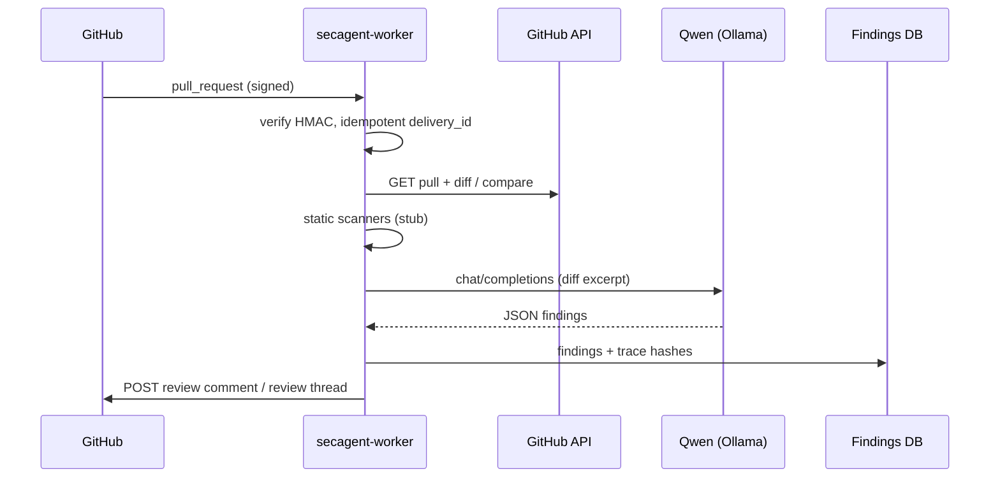

# GitHub PR integration

## GitHub App (recommended)

Create a GitHub App under **li-langverse** (or a dedicated `secagent` app) with:

### Permissions

| Permission | Access | Why |
|------------|--------|-----|
| Pull requests | Read & write | Read diffs, post review comments |
| Contents | Read | Fetch files at `head` SHA |
| Metadata | Read | Repo identity |
| Checks | Read (optional) | Gate on CI later |

### Webhook events

Subscribe to:

- `pull_request` — `opened`, `synchronize`, `reopened`, `ready_for_review`
- `installation` / `installation_repositories` — org onboarding
- `ping` — health

Webhook URL (staging example):

```text
https://secagent.<your-edge-host>/webhooks/github
```

For homelab without public ingress, use **smee.io** or Tailscale funnel temporarily, or run the agent in CI that polls — production uses the same handler path.

### Webhook → agent flow



## Review comment format (MVP)

```markdown
## SecAgent security review

| Severity | Category | Location | Issue |
|----------|----------|----------|-------|
| high | secrets | `src/auth.ts:42` | Hardcoded API key pattern |

<sub>Review id: `8b2e…` · [Open findings](https://secagent.internal/reviews/8b2e…)</sub>
```

Use a single summary comment per synchronize, or inline comments via Pull Request Review API for file-level anchors.

## Environment variables

See `.env.example`. Required for production webhook path:

- `GITHUB_WEBHOOK_SECRET`
- `GITHUB_APP_ID` + private key (or `GITHUB_TOKEN` for PAT-only dev)

## Majico integration (PR #70 and beyond)

1. Install the GitHub App on `cap-jmk-launchpad/majico` (or li-langverse fork).
2. Point webhook to the worker Service — in-cluster: `http://secagent-worker.secagent-staging.svc.cluster.local:8787/webhooks/github`.
3. From majico CI (optional): call `POST` with dry-run header for preview reviews on `pull_request` label `security-agent`.
4. Store `SECAGENT_REVIEW_URL` in majico staging secrets for deep links from Studio / admin.

No CodeRabbit-style full UI in MVP — comments + DB link only.

## Idempotency

Key: `(delivery_id)` from `X-GitHub-Delivery`. Replays with same delivery return `202` without duplicate findings.

## Security

- Verify `X-Hub-Signature-256` always in production.
- Scope installation tokens per repo.
- Never log raw `GITHUB_APP_PRIVATE_KEY` or full diffs at `info` level.
