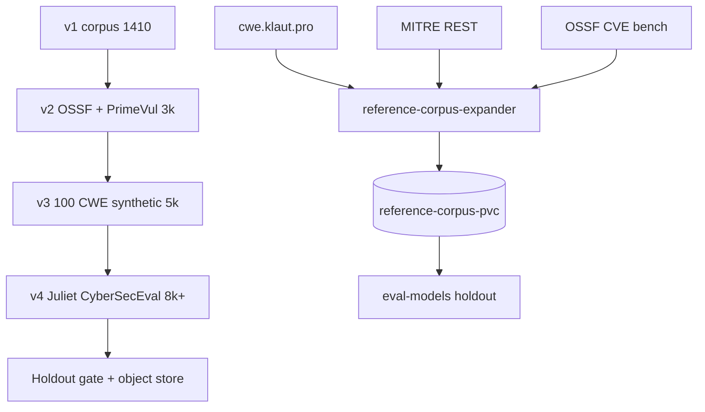

# Reference security database — roadmap to completion

**Mission:** Grow the canonical PR/diff review benchmark from **v1 (1,410 cases)** to a **versioned, holdout-gated corpus (5k–8k+)** suitable for F-measure baselines, fine-tuning, and weekly refresh on homelab Kubernetes.

**Canonical location:** `eval/reference-database/` (git) + PVC `/data/corpus/` (cluster worker).

---

## Phase summary

| Phase | Target cases | Status | Primary work |
|-------|-------------|--------|--------------|
| **v1** | **1,410** | **Done** | Multilang 840 + CWE expanded + synthetic expansion + OSSF metadata subset |
| **v2** | **3,000** | In progress | OSSF git diffs (218 CVEs), PrimeVul 50 pairs, eval CWE breakdown |
| **v3** | **5,000** | Planned | 100 CWEs × 5 scenarios × 6 langs; backlog P2 → 100 entries |
| **v4** | **8,000+** | Planned | Juliet sample port, CyberSecEval adapters, holdout F1 gate |
| **Done** | 5k+ holdout baseline | — | Weekly refresh CronJob, versioned corpus in object store |

---

## v1 — Complete (1,410 cases)

| Source | Cases | License |
|--------|-------|---------|
| multilang-synthetic | 726 | MIT |
| cwe-expanded-synthetic | 104 | MIT |
| reference-expanded-synthetic | 400 | MIT |
| ossf-cve-benchmark | 180 | MIT metadata |

**Deliverables:** `corpus-v1.json`, `manifest.json`, `schema.json`, smoke eval baselines.

**Worker responsibility:** Seed PVC from image; no expansion required.

---

## v2 — 3,000 cases

**Goal:** Real CVE diffs + paired vuln/fix imports; eval reports by CWE.

### Work packages

| ID | Title | Deps | Est. | Owner |
|----|-------|------|------|-------|
| WP-v2.1 | OSSF full 218 CVE ETL with `OSSF_USE_GIT=1` + shallow clone cache on PVC | v1 | 3d | Worker |
| WP-v2.2 | `fetch-ossf-cve-subset.ts` incremental limit + dedupe against corpus | WP-v2.1 | 1d | Worker |
| WP-v2.3 | PrimeVul 50 pairs (C/C++ heavy) → `eval/reference-database/primevul-subset.json` | WP-v2.2 | 3d | Manual + script |
| WP-v2.4 | `eval-models.ts` CWE breakdown in summary JSON | v1 harness | 1d | CI |
| WP-v2.5 | License scan per upstream OSSF/PrimeVul repo | WP-v2.3 | 1d | Manual |

### Worker per-cycle (v2)

1. Pull CWE mirror snapshot (`cwe-inventory --write-snapshot`).
2. MITRE enrich next **5** backlog CWEs (`MITRE_LIMIT=5`, rate 350ms).
3. OSSF fetch with rising `OSSF_LIMIT` (+10/cycle, cap 218).
4. Optional: clone/update OSSF cache on PVC when `OSSF_USE_GIT=1`.
5. `expand-reference-corpus` with `TARGET_EXTRA` batch (+50/cycle).
6. `build-reference-db` → publish `corpus-latest.json`.
7. Emit progress event to `expansion-progress.jsonl`.

### Dependencies

- Homelab `cwe.klaut.pro` mirror (namespace `cwe`, deployment `cwe-mirror`).
- Network egress for MITRE REST + GitHub raw (OSSF).
- PVC `reference-corpus-pvc` (5Gi).

### Exit criteria (v2)

- ≥3,000 unique cases, ≥80 unique CWEs.
- ≥150 OSSF-derived cases with git diffs where repos are OSS-licensed.
- PrimeVul 50 pairs merged with provenance.

---

## v3 — 5,000 cases

**Goal:** Systematic synthetic coverage — **100 CWEs × 5 scenarios × applicable langs** (target ~3,000 new synthetics after dedupe).

### Work packages

| ID | Title | Deps | Est. | Owner |
|----|-------|------|------|-------|
| WP-v3.1 | Expand backlog to 100 CWEs (P2 memory/crypto/config) | v2 taxonomy | 2d | Manual |
| WP-v3.2 | `generate-cwe-scenarios.ts` batch mode per tier | WP-v3.1 | 2d | Script |
| WP-v3.3 | Template registry refactor — archetypes per CWE family | WP-v3.2 | 3d | Script |
| WP-v3.4 | Negative-safe variants (30% ratio) per archetype | WP-v3.3 | 2d | Script |
| WP-v3.5 | Cross-lang port matrix (skip N/A cells) | WP-v3.3 | 2d | Script |
| WP-v3.6 | Worker: auto-stop when `manifest.stats.total_cases >= TARGET_CASES` | v2 worker | 0.5d | Worker |

### Worker per-cycle (v3)

Same as v2, plus:

- `TIER_FILTER=P2` expansion passes after P0/P1 saturated.
- `MIN_SCENARIOS_PER_CWE=5` enforced per backlog item.
- CronJob **suspends** (or Job exits 0 with `WORKER_FINISHED=1`) when target reached.

### Exit criteria (v3)

- ≥5,000 cases, ≥100 unique CWEs.
- Holdout split ≥500 cases (10%).
- No duplicate `content_hash`.

---

## v4 — 8,000+ cases

**Goal:** External benchmark ports + holdout quality gate before declaring corpus **complete**.

### Work packages

| ID | Title | Deps | Est. | Owner |
|----|-------|------|------|-------|
| WP-v4.1 | NIST Juliet sample (synthetic port, not full corpus) | v3 | 5d | Script |
| WP-v4.2 | CyberSecEval snippet adapters (MIT, no full benchmark) | v3 | 3d | Script |
| WP-v4.3 | Holdout eval gate: F1 ≥ baseline − 2pp on qwen3.5:9b | v3 corpus | 2d | CI + homelab |
| WP-v4.4 | Versioned export to MinIO/S3 (`corpus-v{N}.json` + manifest) | v3 worker | 2d | Worker |
| WP-v4.5 | Weekly refresh + catalog drift alert (CWE mirror SHA change) | WP-v4.4 | 1d | CronJob |

### Done criteria (corpus complete)

| Criterion | Target |
|-----------|--------|
| Total cases | ≥5,000 (stretch 8,000+) |
| Holdout cases | ≥500 |
| Holdout F1 baseline | Recorded in `baselines.json`; gate in CI |
| Refresh | Weekly CronJob + manifest `generated_at` |
| Storage | Versioned blobs in object store; `corpus-latest.json` on PVC |
| Safety | Synthetic + eval-only OSSF/PrimeVul; no weaponization |

---

## Homelab worker alignment

| Component | Path / name |
|-----------|-------------|
| Namespace | `secagent-staging` (shared with sec-agent) |
| CronJob | `reference-corpus-expander` — `0 */6 * * *` (every 6h) |
| PVC | `reference-corpus-pvc` → mount `/data/corpus` |
| ConfigMap | `reference-expander-env` — `TARGET_CASES=5000`, batch sizes |
| Image | `li-sec-agent-reference-worker:staging` (local k3s) |
| Progress | `/data/corpus/expansion-progress.jsonl`, `worker-state.json` |

See [REFERENCE_DATABASE.md](./REFERENCE_DATABASE.md#homelab-worker) for deploy and ops runbook.

---

## Dependency graph

---

## Related docs

- [REFERENCE_DATABASE.md](./REFERENCE_DATABASE.md) — schema, build pipeline, homelab worker
- [CWE_BENCHMARK_EXPANSION_PLAN.md](./CWE_BENCHMARK_EXPANSION_PLAN.md) — CWE taxonomy and templates
- [OFFICIAL_EVAL_BENCHMARKS.md](./OFFICIAL_EVAL_BENCHMARKS.md) — OSSF, PrimeVul, licensing
